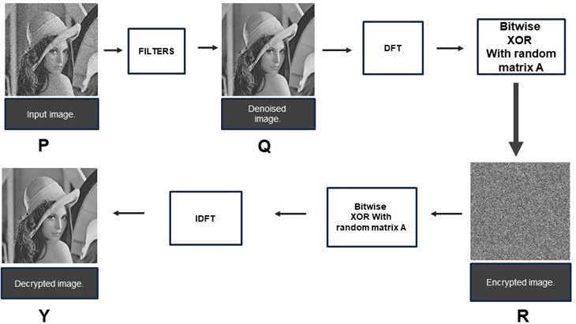
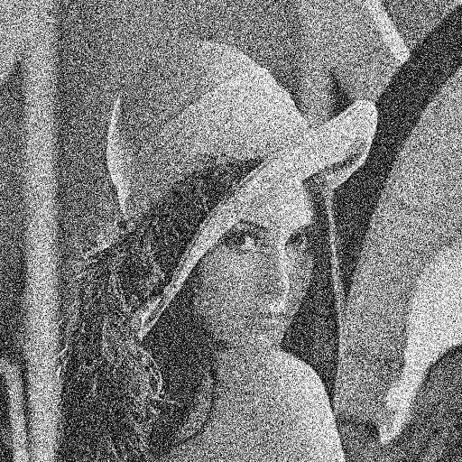
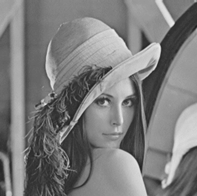
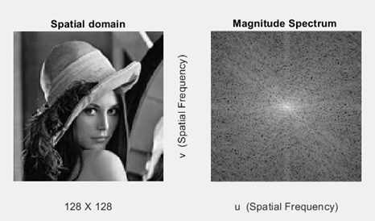
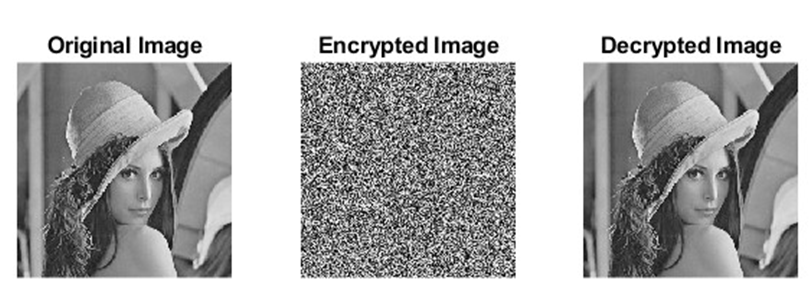

# Image Encryption and Decryption

This project focuses on obtaining a clear image by filtering out noise types like Gaussian noise before applying an encryption algorithm.

## Description
# Embedded MicroController.

  

To achieve a clear image, we start by denoising input images containing various noise types. The denoising process involves applying appropriate digital filters, resulting in a denoised image "Q." The subsequent encryption process utilizes Bitwise XOR and Discrete Fourier Transform (DFT), introducing an additional encryption stage for heightened security.

### Encryption Process

1. **Denoising:**
   - Apply digital filters to input image "P" to obtain denoised image "Q."
  

  
  

2. **2D-DFT (Discrete Fourier Transform):**
   - Apply 2D-DFT to the denoised image "Q" to obtain magnitude and phase matrices.
  
      

       
          

3. **Bitwise XOR with Random Matrix:**
   - Bitwise XOR the magnitude and phase matrices with a random matrix "A" to generate an encrypted image "R."

### Decryption Process

1. **Bitwise XOR:**
   - Perform Bitwise XOR on the encrypted image "R" with the random matrix "A."

2. **IDFT (Inverse Discrete Fourier Transform):**
   - Obtain the IDFT of the resulting matrices to decrypt and generate the final image "Y."

     

  

### Security

The encryption scheme introduces an additional stage, enhancing the security of the process. The decryption process requires the correct key to obtain the original image.

## Getting Started

To explore and implement this image encryption and decryption algorithm, refer to the code provided in the repository. 
##Find the list of codes:

1. **computedft.m** - Computes the Discrete Fourier Transform (DFT) of an image.
2. **noisecreate.m** - Adds Gaussian noise with given mean and standard deviation to an image.
3. **denoisework.m** - Denoises an image using a Finite Impulse Response (FIR) Blackman window filter.
4. **encryption.m** - Encrypts and decrypts the image using DFT and bitwise XOR, ensuring two-stage security.

